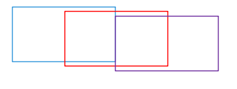

# FLINK

**基本认知：** 

一个流式计算框架，代入Hadoop生态圈最多替代MapReduce。计算过程都在内存中，所以速度相对MR很快，中间除了shuffle基本不落盘。出现落盘要么OOM了，要么就是在切依赖(宽依赖的时候会切)划分阶段，要么就是代码中调用了导致落盘的函数。因为IO少所以速度飞快。然后就是Flink脱颖而出的最核心理念——流式计算。在实时响应计算方面，流式处理在无限数据流(或者说实时数据流)方面的优势是批处理无法抹平的，得益于流式的时间状态而来的容错恢复等机制更是甩了批处理几条街，所以flink做实时`牛啤`还真不是白吹的。

## 一. 重要概念

### 1.时间状态

按照先后顺序，大致可以划分为：

#### 1.1 Event Time(事件时间)：事件发生(数据产生)的时间

用的比较多。

数据产生的时候会记录下当(时)的时间，也就是事件时间。

#### 1.2 Ingestion Time(**提取时间**)：事件(数据)进入Flink窗口的时间

就没见过用这个的。

数据进入窗口的时候，会记录一个时间，就是提取时间，一般比处理时间要晚。

#### 1.3 Processing Time(处理时间)：Flink处理事件(数据)的时间

进行处理的时候的系统当前时间。当系统运行在处理时间语义下的时候，将不会管事件时间等其他因素，会在这个事件到达flink系统的时间记录下来，类似给了一个唯一的有顺序的ID，之后的操作都按照这个时间来。

计算时用能避免很多问题，但是问题就是无法保证数据的准确性(肯定没法保证啊，断网断电老鼠咬断网线集群突然宕机都会导致数据传输不按照顺序来)。

### 2.窗口机制

前：在实际生产中，数据是源源不断产生的，而且用户行为不可控，间接导致实时的场景下数据流的数据量和时间跨度也是不可控的。Flink提供了窗口的概念，将无限不可控的流划分出边界，使得计算可以进行。

**？？？**然而在这一块有一个一度困扰我很长时间的问题：窗口究竟是根据什么时间划分的？

有三种窗口的概念，而窗口的划分又有多种形式，最常见的是时间和计数。这里用时间做窗口划分举例

#### 2.1 滚动窗口（roll window）

在无限的事件流上定义一段时间为一个窗口，在此期间的所有数据在该窗口内，该窗口到临界是会创建一个新的窗口，所以最终窗口不会重叠，呈滚动效果。

比如，定义窗口size=10 s，则0-10秒内的所有数据属于一个窗口，而11-20秒的数据属于另一个窗口......这样就将一个没有边界的无限流切分成了许多小窗口，而每个窗口的值都是可以直接计算的。比如现在业务场景下需要计算一分钟内的访问量，此时对前六个窗口的数据做count处理就可以计算出访问量了。

滚动窗口的API只需要传一个参数，所以使用起来也很简单，但是在使用事件事件语义时会产生一些问题，这个后面再说。

#### 2.2 滑动窗口(slide window)

在滚动窗口的概念上，将新窗口的触发条件从达到临界值改成达到一个可自定义的步长，达到该步长即创建一个新的窗口，这样的话会导致窗口之间有重叠的部分，虽然相对滚动窗口要稍微麻烦了一点，但是却能进行更多更精细的操作。

比如场景一，窗口长度还是10，步长为5，每5秒产生一个新窗口，那么前20秒就产生了三个完整的窗口，**第四个窗口还没算完所以就没加上了**。

此时，业务上需要计算每20秒前后五秒的数据的数据该怎么操作？好了现在window123的结果都计算出来了,接下来：

result=w1+w3-w2

好了问题解决，当然我这只是瞎编的例子，说明用的，便于理解。

场景二，窗口大小为5，步长为10

此时，编一个比较离谱的业务：从第五秒开始每隔5秒会传一批持续5秒的脏数据，这时候用滚动窗口的话会接收到脏数据，造成资源的浪费，影响性能。此时滑动窗口就可以完美地解决这个问题。其实虽然这个例子很离谱，但是不同业务场景下的需求真的千奇百怪，不能以常理踱之，只能不断充实提高自己以面对各种各样的问题和挑战。

#### 2.3 会话窗口（session window）

这是一个比较特殊的窗口，它是以传入数据时的空闲间隔为依据划分窗口的，原理和session类似，但是千万不要直接理解为和session直接绑定(-_- !)。

如图，设置空闲间隔(正式名称叫session gap)为5秒，第一个窗口接收了10秒的数据，然后过了5秒没来新数据，就会由触发器执行生成一个新的窗口，然后第二个窗口因为用户操作比较密集，持续了30秒，然后又因为用户10秒没有操作而又开启了第三个窗口。当然这30秒内有可能存在操作空闲时期，但是每次都停下没到五秒钟就又开始了，所以没有触发新开窗口的操作，直到第三个窗口出来之前空闲了10秒，但是注意其实第三个窗口是在第十秒才开始的，也就是说空闲到达五秒的时候，触发触发器关闭上一个窗口(可以进行计算了)，然后等到第十秒来新的数据了，又开了一个新的窗口 (这里我又特地去了解了一下，其实每个数据进来的时候都会创建一个窗口，而如果这个窗口和上个窗口的间隔小于session gap也就是设置好的空闲间隔时间的时候，就会进行合并窗口操作，如果大于空闲间隔时间，就保留新开的窗口，关闭原先的窗口，然后后面来的数据放到新窗口中) 。

总之会话窗口的好处很明显，相对前两种，如果长时间没数据过来的时候会大大节省资源，但是同时，在并发量比较高的场景下，如果持续(甚至都不用大量)来数据可能会导致窗口过大的问题，一个窗口存的数据太大的话算起来就比较有压力。

但是无论用哪一种窗口都得根据业务情况来。

### 3.水印(Watermarks)

在滚动和滑动窗口中，如果数据按照事件时间进行计算的话，就不得不考虑数据丢失或者数据延时的问题，实际上在数据传输过程中很容易发生意外情况(断网断电老鼠咬断网线集群突然宕机)导致数据传输乱序。而如果窗口使用的是处理时间语义自然没有问题，但是如果使用的是事件时间语义的话，这样会导致窗口接受到的数据不全。而watermarks机制就是给这些窗口加上一个触发器和一个"盖子"，比如当窗口达到一定水位(watermark)的时候，触发器就会关闭这个窗口(盖上盖子)。这里，我用尽毕生所学将这个概念总结成一句通俗易懂的话：**“最多等你十分钟，再不来俺就走了”**是的，俺们农村人就是这么朴实无华，十分钟就是水位，我走了就是触发器()，十分钟一到没看见人过来立马开溜。如果想要保证数据安全，就要用事件时间，但是如果因为未知原因导致这个事件时间内的某一个包要迟一会才能发过来，将会造成大量窗口处于等待状态无法关闭。

### 4.触发器

简单来说就是用来做执行操作的启动器，换算成代码中的概念就类似触发算子的概念。

因为Flink作为一个计算引擎，最终是要对数据进行计算的，而计算的规则或者说方法就要通过窗口函数调用各种算子来执行，而程序只有碰到触发算子才会真正开始执行。就比如在上文达到水位以后，如果触发器坏了，那么不管水涨的有多高窗口也不会关闭。就好像在水位处放了一个通着电的开关，一旦水涨到这里了，通上电了，啪一下，很快啊，盖子就盖上了。

废话不多说了，想要弄懂触发器就要到代码里面去看，今天就先不看了。

### 5.checkpoint(检查点)

喜欢打游戏的人都知道存档功能，随手存档是个好习惯。不过很多游戏都会有自动存档过程，这个过程就类似checkpoint功能。比如在一段长——长的过场动画后，如果没有自动存档的话，一旦在结束的时候卡死，下次进来就要再看一般，非常地反人类，但是一旦有自动存档下一次就可以继续体验内容，而不用再等一次过场动画了(除非真的又大又好看)，一般人是等不了第二次的，如果等第二次就会很暴躁，但是程序不会，它只会默默地等待，让坐在电脑前的程序员非常暴躁。说实话下午啥事也没干一直在写这个我也是有点烦了，一直码字还得查文档验证一些说法有点枯燥，不过过程中收获也有很多，就换种说法娱乐下自己。

怎么解决这个问题呢？回归正题，比如现在有一个比较大的计算任务，咱们分成10000个窗口分别执行计算然后merge结果，但是有点大，内存装不下了，这时候就可以每100个窗口的计算存一次盘，然后再把存下的100个小文件中的结果合并一下就可以了。

再比如，现在好好地，每算到100个窗口任务就挂一次，然后重启机制触发再启动重新算，最后等一个小时发现进度还在10%，明显有问题，现在发现这个节点很有规律地每十分钟挂一次，然后又神奇地好了。怎么解决呢？好了，现在从1算到100的时候要用九分钟，很好，我们在这时候存一次盘，然后等第二批计算的时候挂掉了，但是不碍事，我们这次从101开始算......最终我们的任务是可以完成的，顺便给运维找点事做，多好。

checkpoint用到的地方很多，但是概念都大差不差。

## 二. 集群架构（纯手打文字版）

如果是需要搭建一整套的流式处理系统的话，首先就得配合业务流程，但是如果抛出业务只谈数据流的话，其实架构都差不多：

1.最原始的数据源，第一种是业务数据库里面的数据，比如mysql，Oracle等等，公司APP或者业务操作产生的数据大部分都在这里了；第二种是前端埋点产生的日志文件，通过数据收集服务器(Nginx)存储

(生成数据)

2.flume一般用来拉取日志文件，可以从Nginx上通过source 抓取日志文件，通过channel传输然后sink到消息中间件kafka中；mysql的数据也可以用canal抓取到kafka中，用于计算。

(存)

3.flink从kafka拿到数据实时计算，将结果存到mysql等数据库中，并由后端人员编写接口，提供给前端人员

(算)

4.前端做可视化，在页面展示或者做成报表。

(做成老板能看懂的样子)

